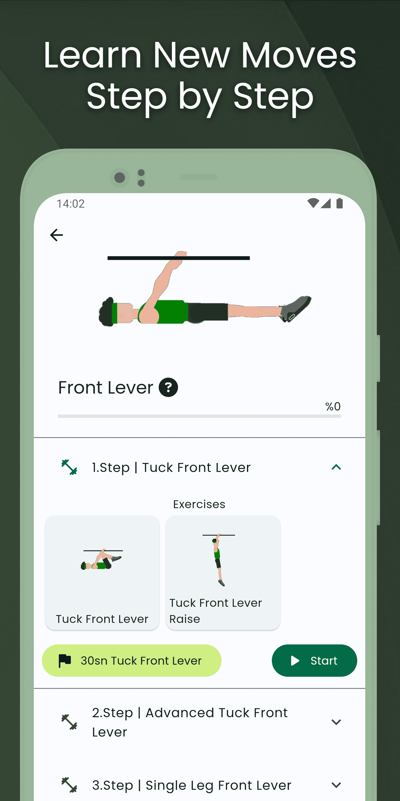

## Gorilla Workout

I completed and published the Street Workout mobile application, which I made alone, using Flutter language. It has multi-language support, animations, databases for professional training, easy and simple interface design. Multi-language support is available throughout the application, including exercise descriptions. English and Turkish languages have been added. The remaining languages will also be added. All content in the application, including language translations, character drawings, animations, movement descriptions, interfaces, training programs, was created by me.

My app is now available on [Google Play](https://play.google.com/store/apps/details?id=com.koznotech.gorillaworkout&pcampaignid=pcampaignidMKT-Other-global-all-co-prtnr-py-PartBadge-Mar2515-1).

### Screenshots

<table>
  <tr>
    <td align="center">
      
    </td>
    <td align="center">
      
    </td>
    <td align="center">
      
    </td>
  </tr>
  <tr>
    <td align="center">
      
    </td>
    <td align="center">
      
    </td>
    <td align="center">
      
    </td>
  </tr>
</table>
